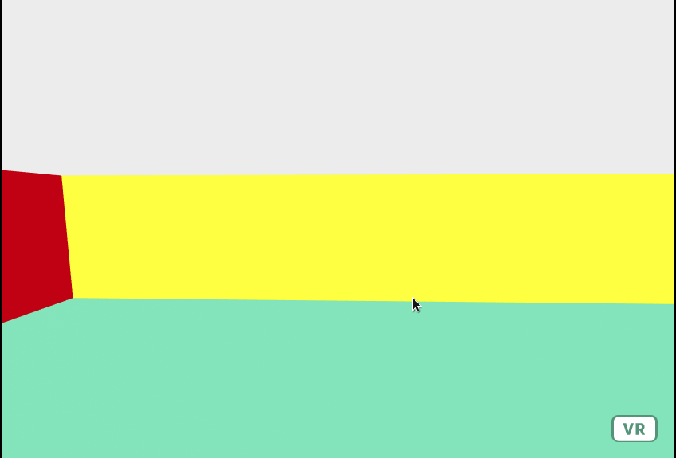

# Wall Collide

Wall Collide is an A-Frame component that will repel one entity from another.

## Installation

Include the component file in the head of your HTML document:

```html
<script type="text/javascript" src="wall-collide.js"></script>
```

## Dependencies

You shoul dalso include the aframe-aabb-collider-component[https://www.npmjs.com/package/aframe-aabb-collider-component] in the head of your HTML:

```html
<script src="https://unpkg.com/aframe-aabb-collider-component@3.1.0/dist/aframe-aabb-collider-component.min.js"></script>
```

## Usage

```html
<a-box 
  wall-collide="
    pushAxis: x;
    pushDirection: 1;
    pushStrength: .5;
    pushTarget: a-camera;" 
  aabb-collider="objects: a-camera; " 
>
</a-box>
```

Attach the `wall-collide` component to any entity, and pass in the relevant parameters. 

## Caveats

This only really works if your walls are aligned exactly along the x and z axes. 

## Parameters

| Parameter          | Default  | Description |
|--------------------|--------- |-------------|
| **pushAxis**       | none     | The axis which your wall should repel entities|
| **pushDirection**  | none    | The direction you should push in (must be 1 for the postive direction or -1 for the negative direction)|
| **pushStrength**    | none       | The amount to push entites off the wall|
| **pushTarget** | none | The CSS selector of the entity your wall should repel |

## Example



## Contributing
Pull requests are welcome. For major changes, please open an issue first to discuss what you would like to change.


## License
[MIT](https://choosealicense.com/licenses/mit/)
